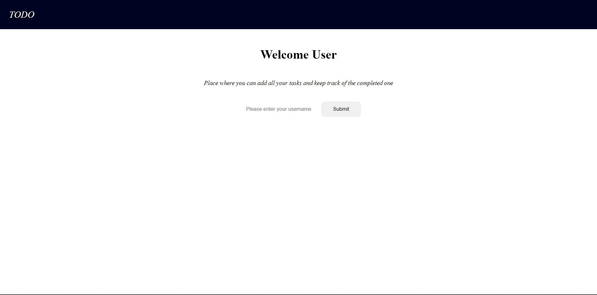
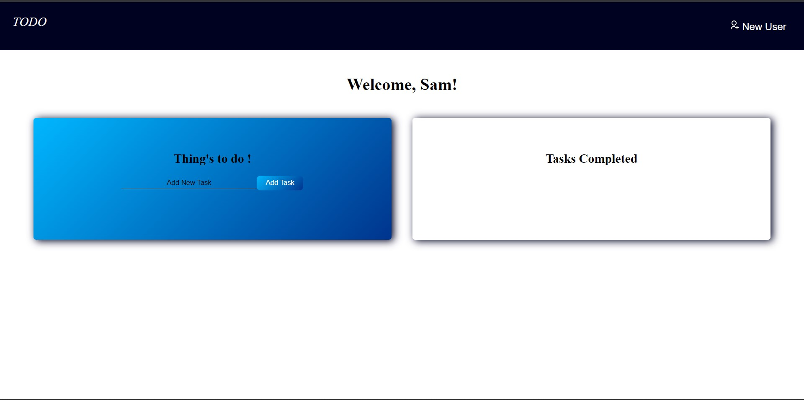
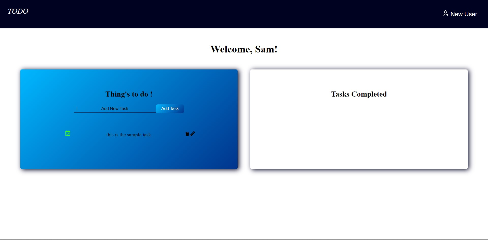
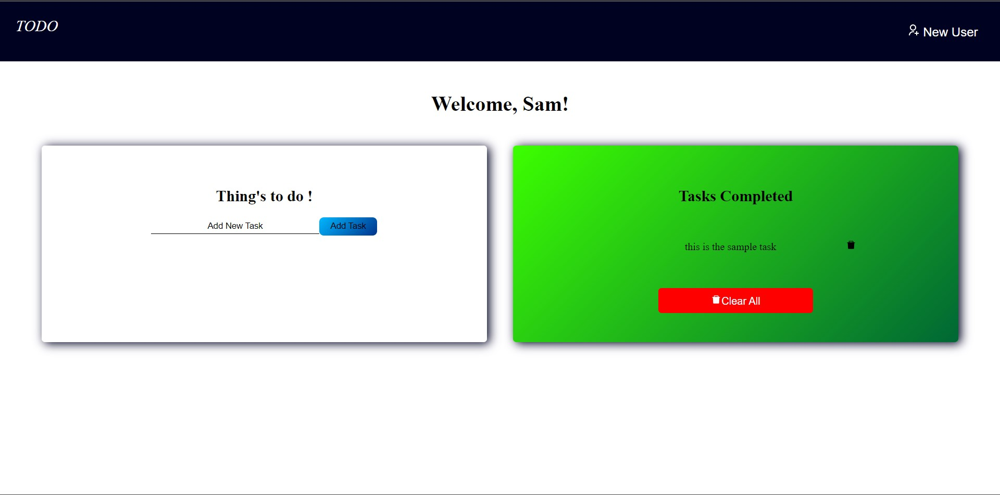
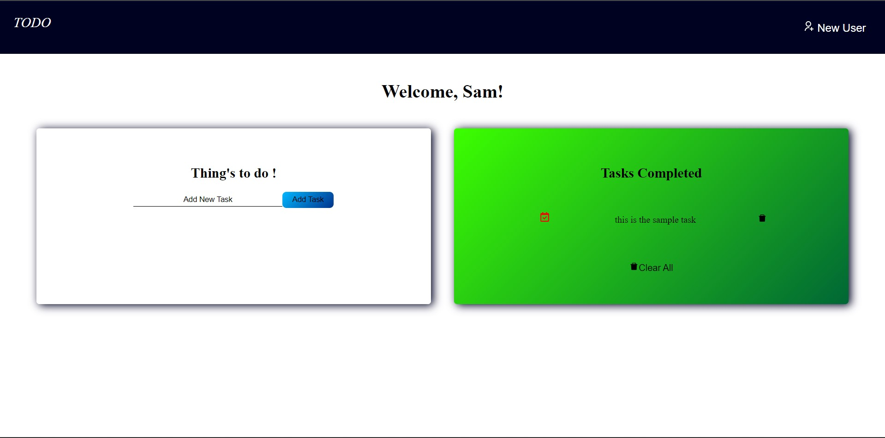

# [TO DO LIST](https://mytodolister.netlify.app/)

    Hello Users / Viewers
     
    The app where you can take down all the tasks of the day and mark them as pending or completed. 
     

## Screenshots of the App
---
---

### Welcome Page

### Home Page

### Task Addition and Completion

## Tech Stack
---
---

- [ReactJS](https://reactjs.org/): Technology used for building App and its function
- [VS Code](https://code.visualstudio.com/): Code editor used for writing the code
- [React Icons](https://react-icons.github.io/react-icons): Used for importing the icons used in the webapp

 

### Note: Link for the APP is in the heading